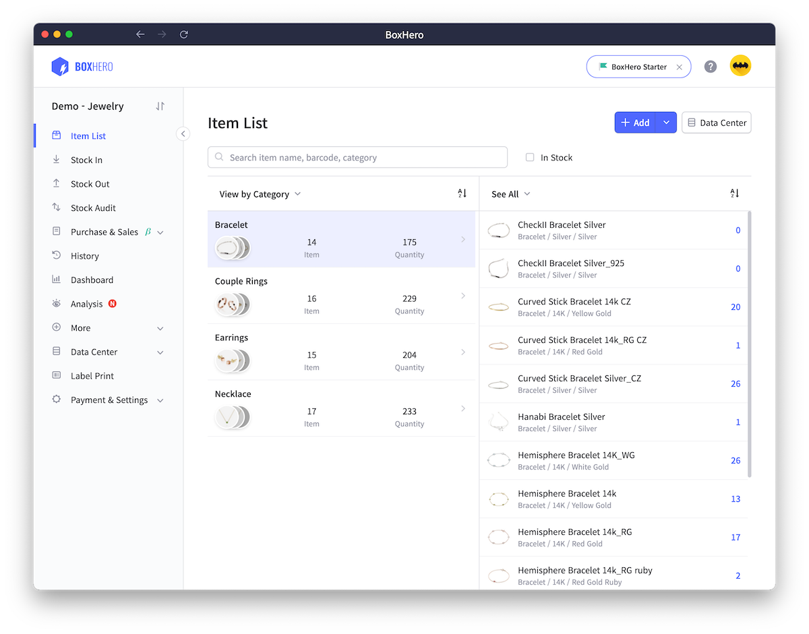
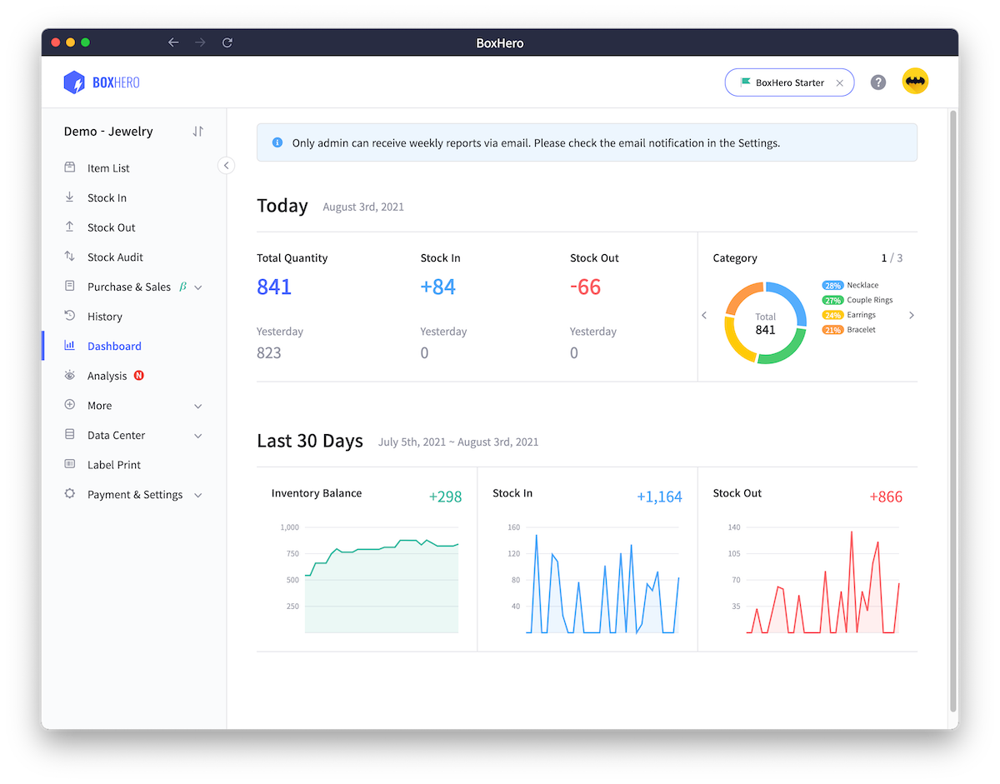
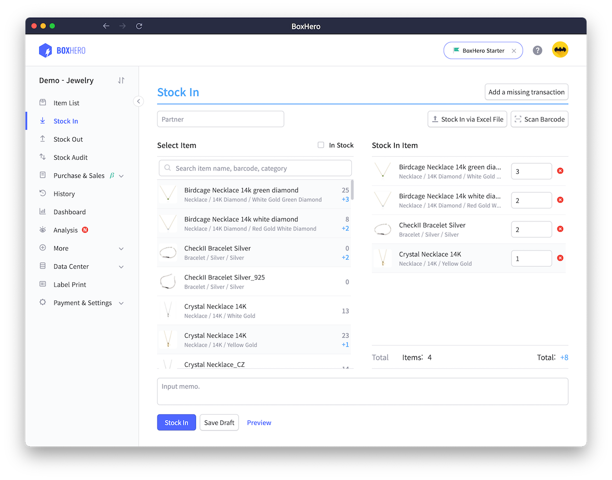
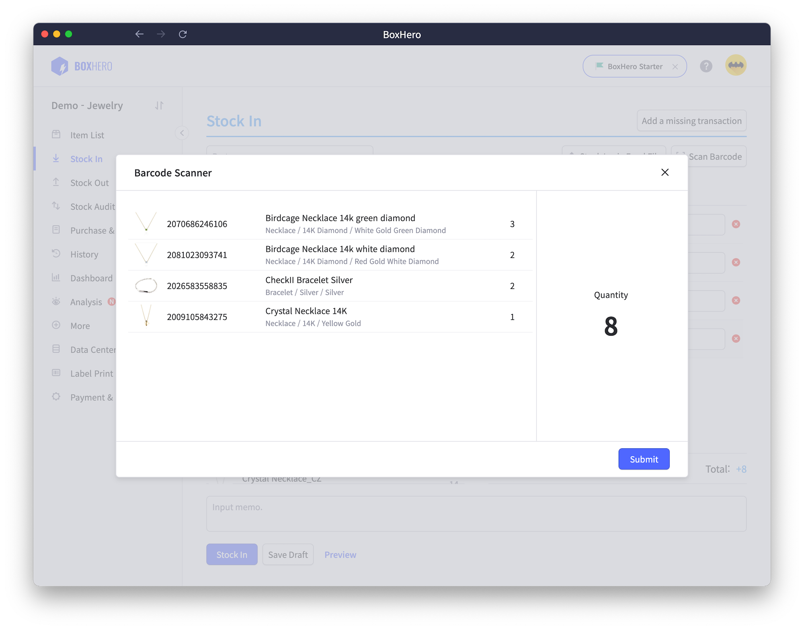
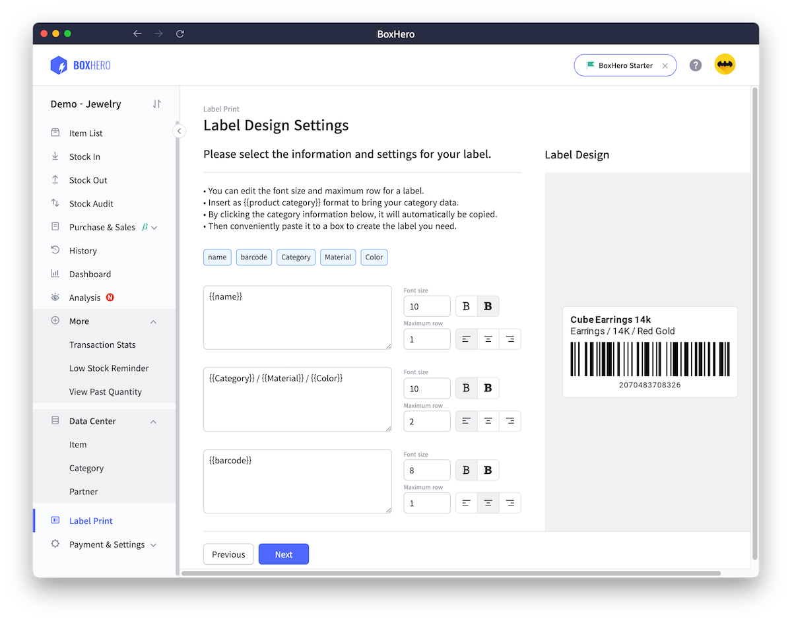
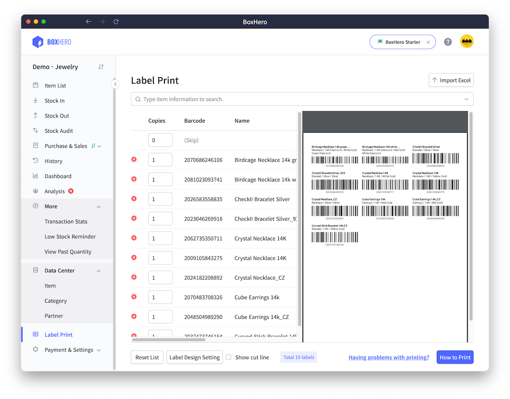
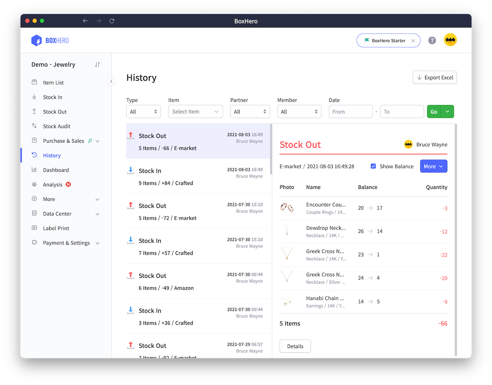

# BoxHero Desktop App

[박스히어로](https://www.boxhero-app.com) 데스크톱 앱



## NPM Scripts

### 설치

```sh
yarn install
```

### 개발

```sh
yarn start
```

### 패키징 & 배포

```sh
# 실행가능한 app bundle만 생성
yarn package

# 설치파일 생성
yarn make

# 배포
yarn publish
```

## 로컬 빌드를 준비사항

### Code Signing

#### Mac

- Code Sign용 `Developer ID Application` 인증서를 로컬에 설치합니다.
- Notarize를 위한 [App Store Connect API key](#app-store-connect-api-키-생성-방법)를 준비합니다.

#### Windows

- USB Dongle 형태의 Code sign용 인증서를 준비합니다.

### 환경변수 설정

[.env.example](./.env.example) 을 참고하여 필요한 환경변수들을 설정합니다.

`# for ci`로 그룹핑된 변수들은 Github action을 통한 빌드시에만 필요한 환경변수이므로 설정하지 않으셔도 괜찮습니다.

## 기타

### App Store Connect API 키 생성 방법

1. [App Store Connect access page](https://appstoreconnect.apple.com/access/api)에 방문.
2. `Keys` 탭으로 이동해 생성 및 다운로드.
3. 다운받은 API key는 `AuthKey_ABCD123456.p8`와 같이 생겼으며, 단 한 번만 다운로드가 가능하니 주의해주세요.

### Mac 빌드시 Code sign & Notarize 스킵하는 방법

환경변수 `SKIP_SIGN`을 `t` 로 설정하면 빌드 단계에서 Code sign & Notarize를 생략합니다.

## 스크린샷








