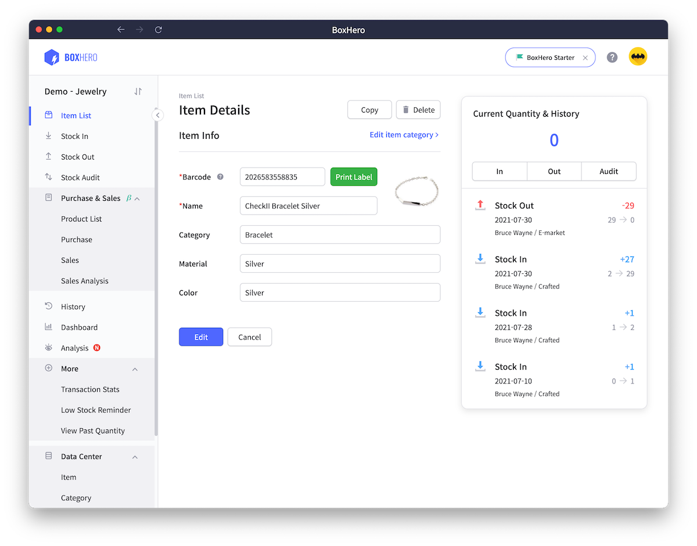

# BoxHero Desktop App

[박스히어로](https://www.boxhero-app.com) 데스크톱 앱


## NPM Scripts

### 설치

```sh
yarn install
```

### 개발

```sh
yarn start
```

### 패키징 & 배포

```sh
# 실행가능한 app bundle만 생성
yarn package

# 설치파일 생성
yarn make

# 배포
yarn publish
```

## 로컬 빌드를 준비사항

### Code Signing

#### Mac

- Code Sign용 `Developer ID Application` 인증서를 로컬에 설치합니다.
- Notarize를 위한 [App Store Connect API key](#app-store-connect-api-키-생성-방법)를 준비합니다.

#### Windows

- USB Dongle 형태의 Code sign용 인증서를 준비합니다.

### 환경변수 설정

[.env.example](./.env.example) 을 참고하여 필요한 환경변수들을 설정합니다.

`# for ci`로 그룹핑된 변수들은 Github action을 통한 빌드시에만 필요한 환경변수이므로 설정하지 않으셔도 괜찮습니다.

## 배포

### 프로덕션 & beta 배포에 대하여

- 환경변수 `DEV_USE_BETA_LANE`가 `t`로 설정된 경우, beta 버전으로 배포할 수 있다.
- beta 버전의 beta 버전만의 릴리즈 히스토리를 따라 업데이트가 진행된다.
- Github action으로 배포시 `release` 브랜치 외에는 `beta`로만 배포가 된다.

### Mac

- 배포가 결정되면, release 브랜치로 배포할 내용들을 모두 일괄 머지한다.
- Github action을 이용해 배포 관련 workflow를 수동으로 트리거한다.
  - `Github` -> `Actions` -> 사이드바에서 `publish-app` workflow 선택 -> `Run workflow`

### Windows

- Mac 버전을 먼저 배포 후 Windows 빌드를 배포하도록 한다.
- 인증서 문제로 로컬에서만 Code signing이 가능하다.
- 배포용 윈도우 머신에 인증서 USB 동글을 삽입한다.
- 파워셸에서 `yarn publish`를 입력하여 배포를 진행한다.
- 중간에 인증서 관련 비밀번호 프롬프트가 표시되므로 확인할 것.

## 기타

### App Store Connect API 키 생성 방법

1. [App Store Connect access page](https://appstoreconnect.apple.com/access/api)에 방문.
2. `Keys` 탭으로 이동해 생성 및 다운로드.
3. 다운받은 API key는 `AuthKey_ABCD123456.p8`와 같이 생겼으며, 단 한 번만 다운로드가 가능하니 주의해주세요.

### Mac 빌드시 Code sign & Notarize 스킵하는 방법

환경변수 `DEV_SKIP_SIGN`을 `t` 로 설정하면 빌드 단계에서 Code sign & Notarize를 생략합니다.

## 스크린샷




